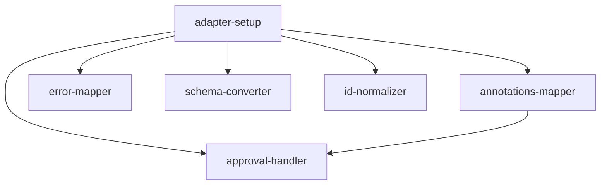

# Adapters Feature — Implementation Plan

## Goal

Implement the five adapter modules (annotations, errors, schema, id_normalizer, approval) that translate between apcore domain types and MCP protocol types in idiomatic Rust.

## Architecture Design

### Component Structure

```
src/adapters/
  mod.rs              # Re-exports public API
  annotations.rs      # AnnotationMapper
  errors.rs           # ErrorMapper
  schema.rs           # SchemaConverter
  id_normalizer.rs    # ModuleIDNormalizer
  approval.rs         # ElicitationApprovalHandler
```

All five modules are stateless adapters with no shared mutable state. They consume apcore types from the `apcore` crate (`ModuleAnnotations`, `ModuleError`, `ErrorCode`, `ApprovalRequest`, `ApprovalResult`, `ApprovalHandler`) and produce MCP-compatible output (either `serde_json::Value` dicts or domain structs).

### Data Flow

```
apcore types ──► Adapter ──► MCP wire types (serde_json::Value / structs)
```

- **AnnotationMapper**: `&ModuleAnnotations` -> MCP `ToolAnnotations` struct (serde-serializable with `#[serde(rename_all = "camelCase")]`).
- **ErrorMapper**: `&ModuleError` -> MCP error response `Value` with camelCase keys via `serde_json::json!()`. Internal/ACL codes are sanitized. AI guidance fields are mapped snake_case -> camelCase using serde rename.
- **SchemaConverter**: `&Value` (JSON Schema) -> `Value` with `$ref` inlined, `$defs` stripped, root `type: "object"` enforced. Recursive traversal on `serde_json::Value`.
- **ModuleIDNormalizer**: `&str` -> `String`. Bijective dot<->dash mapping. Regex validation via the `regex` crate (already in Cargo.toml).
- **ElicitationApprovalHandler**: Implements `apcore::approval::ApprovalHandler` trait. Uses an injected async elicit callback (`Arc<dyn Fn(...) -> Pin<Box<dyn Future<...>>>>`) to bridge MCP elicitation to apcore approval.

### Technology Choices with Rationale

| Choice | Rationale |
|--------|-----------|
| `serde_json::Value` for schema traversal | Schemas are dynamic JSON; no compile-time shape. `Value` allows recursive traversal without code generation. |
| `serde` with `#[serde(rename_all = "camelCase")]` | MCP wire format uses camelCase; serde rename is zero-cost and idiomatic. |
| `regex::Regex` with `LazyLock` for MODULE_ID_PATTERN | Compile regex once, reuse. `LazyLock` (std since 1.80) avoids `lazy_static` dependency. |
| `thiserror` for adapter-specific errors | Already in Cargo.toml. Provides ergonomic `#[error]` derive for `SchemaConversionError`. |
| `async-trait` for `ApprovalHandler` impl | Required by the `apcore::approval::ApprovalHandler` trait definition. |
| `tracing` for logging in approval handler | Already in Cargo.toml. Structured logging is preferred over `log`. |
| Typed MCP structs (`McpToolAnnotations`, `McpErrorResponse`) | Prefer concrete types over raw `Value` where the shape is fixed. Enables compile-time correctness and better documentation. |

### Error Handling Strategy

Define a local `AdapterError` enum in `mod.rs` for adapter-specific errors:

```rust
#[derive(Debug, thiserror::Error)]
pub enum AdapterError {
    #[error("schema conversion failed: {0}")]
    SchemaConversion(String),
    #[error("invalid module ID '{id}': must match {pattern}")]
    InvalidModuleId { id: String, pattern: &'static str },
}
```

`ErrorMapper` itself does not return errors — it transforms them. `SchemaConverter` returns `Result<Value, AdapterError>` for circular refs and depth exceeded. `ModuleIDNormalizer::normalize` returns `Result<String, AdapterError>`.

## Task Breakdown

### Dependency Graph



### Task List

| Task ID | Title | Est. Time | Dependencies |
|---------|-------|-----------|--------------|
| adapter-setup | Scaffold shared types, `AdapterError` enum, and module re-exports | 1h | none |
| annotations-mapper | Implement `AnnotationMapper` with MCP hint mapping and description suffix | 2h | adapter-setup |
| error-mapper | Implement `ErrorMapper` with sanitization, AI guidance, and camelCase output | 3h | adapter-setup |
| schema-converter | Implement `SchemaConverter` with recursive `$ref` inlining | 3h | adapter-setup |
| id-normalizer | Implement `ModuleIDNormalizer` with regex validation | 1h | adapter-setup |
| approval-handler | Implement `ElicitationApprovalHandler` bridging MCP elicit to apcore approval | 2h | adapter-setup, annotations-mapper |

**Total estimated time: ~12 hours**

## Risks and Considerations

### Technical Challenges

1. **Recursive `$ref` inlining on `serde_json::Value`**: The Python implementation uses `copy.deepcopy` and mutable dict manipulation. In Rust, `Value::clone()` serves the same purpose, but the recursive traversal must be careful with ownership. Use `Value` methods (`as_object()`, `as_array()`) and rebuild via `serde_json::Map` to avoid borrow-checker issues.

2. **Circular `$ref` detection**: The Python implementation tracks seen refs in a `set`. In Rust, use `HashSet<String>` passed by value (clone on branch) to match the Python immutable-set-per-branch semantics. This prevents false positives on diamond-shaped (non-circular) references.

3. **ErrorCode matching**: The Rust `ErrorCode` enum uses `#[serde(rename_all = "SCREAMING_SNAKE_CASE")]` for serialization, but matching in code uses enum variants (e.g., `ErrorCode::CallDepthExceeded`). The `ErrorMapper` must match on enum variants, not string codes. This differs from the Python implementation which matches string codes via a `set`.

4. **Async elicit callback type**: The `ElicitationApprovalHandler` needs an injected callback. In Rust, this requires boxing the future: `Arc<dyn Fn(String, Option<Value>) -> Pin<Box<dyn Future<Output = Option<ElicitResult>> + Send>> + Send + Sync>`. This is verbose but standard for async trait object callbacks.

5. **`MODULE_ID_PATTERN` divergence**: The existing Rust constant in `constants.rs` uses `(\.[a-z][a-z0-9_]*)+$` (requiring at least one dot), while the Python pattern allows single-segment IDs like `"ping"`. The normalizer must document this discrepancy and decide whether to align with the Python behavior (allowing `*` instead of `+`).

6. **camelCase wire format**: The MCP error response must use camelCase keys (`aiGuidance`, `userFixable`). Using `serde_json::json!()` with literal camelCase keys is simplest. Alternatively, define a response struct with `#[serde(rename_all = "camelCase")]` and serialize it.

### Testing Considerations

- All adapters are pure functions (except the approval handler's async elicit call), making them highly testable with unit tests.
- The `SchemaConverter` needs property-based tests for deeply nested schemas and edge cases (empty schema, schema with only `$defs`, circular refs).
- The `ElicitationApprovalHandler` needs mock elicit callbacks for testing.
- Integration tests should verify round-trip fidelity between Python and Rust implementations using shared test fixtures.

## Acceptance Criteria

- [ ] `AnnotationMapper` maps `ModuleAnnotations` to MCP hints (`readOnlyHint`, `destructiveHint`, `idempotentHint`, `openWorldHint`)
- [ ] `AnnotationMapper::to_description_suffix` generates warning text for destructive/approval annotations
- [ ] `AnnotationMapper::has_requires_approval` returns correct boolean
- [ ] `ErrorMapper` converts `ModuleError` to camelCase wire format with `isError`, `errorType`, `message`, `details`
- [ ] `ErrorMapper` sanitizes internal codes (`CallDepthExceeded`, `CircularCall`, `CallFrequencyExceeded`) to generic messages
- [ ] `ErrorMapper` sanitizes `AclDenied` to "Access denied" with no details
- [ ] `ErrorMapper` includes AI guidance fields (`retryable`, `aiGuidance`, `userFixable`, `suggestion`) when present
- [ ] `ErrorMapper` formats `SchemaValidationError` field-level errors into readable message
- [ ] `ErrorMapper` handles approval-related error codes (`ApprovalPending`, `ApprovalTimeout`, `ApprovalDenied`)
- [ ] `SchemaConverter` inlines `$ref` references up to depth 32
- [ ] `SchemaConverter` detects and reports circular `$ref` references
- [ ] `SchemaConverter` strips `$defs` after inlining
- [ ] `SchemaConverter` defaults empty schema to `{"type": "object", "properties": {}}`
- [ ] `SchemaConverter` ensures root `type: "object"`
- [ ] `ModuleIDNormalizer` validates module ID against `MODULE_ID_PATTERN`
- [ ] `ModuleIDNormalizer::normalize` replaces dots with dashes
- [ ] `ModuleIDNormalizer::denormalize` replaces dashes with dots
- [ ] `ElicitationApprovalHandler` implements `apcore::approval::ApprovalHandler`
- [ ] `ElicitationApprovalHandler::request_approval` maps "accept" -> approved, all else -> rejected
- [ ] `ElicitationApprovalHandler::check_approval` always returns rejected (Phase B unsupported)
- [ ] All public types derive `Debug`, `Clone` where appropriate
- [ ] All modules have doc comments and `#[cfg(test)]` unit test modules
- [ ] `cargo test` passes with no warnings
- [ ] `cargo clippy` passes with no warnings

## References

- Feature spec: `docs/features/adapters.md`
- Type mapping spec: `apcore/docs/spec/type-mapping.md`
- Python reference: `apcore-mcp-python/src/apcore_mcp/adapters/`
- apcore Rust types: `apcore-rust/src/errors.rs` (`ModuleError`, `ErrorCode`)
- apcore Rust types: `apcore-rust/src/module.rs` (`ModuleAnnotations`)
- apcore Rust types: `apcore-rust/src/approval.rs` (`ApprovalHandler`, `ApprovalRequest`, `ApprovalResult`)
- MCP helpers: `src/helpers.rs` (`ElicitAction`, `ElicitResult`)
- Constants: `src/constants.rs` (`MODULE_ID_PATTERN`, `ERROR_CODES`)
