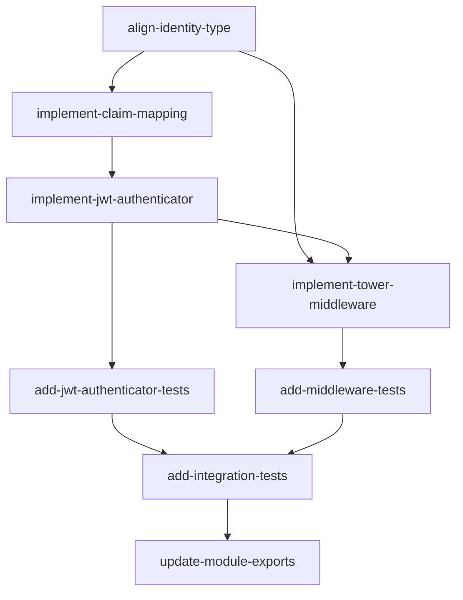

# Auth Feature — Implementation Plan

## Goal

Port the Python authentication module (Authenticator protocol, JWTAuthenticator, ASGI AuthMiddleware) to idiomatic Rust using traits, the `jsonwebtoken` crate, tower middleware, and tokio task-locals.

## Architecture Design

### Component Structure

```
src/auth/
  mod.rs          — public re-exports
  protocol.rs     — Authenticator trait + Identity (re-export from apcore)
  jwt.rs          — ClaimMapping, JWTAuthenticator
  middleware.rs    — AuthMiddlewareLayer, AuthMiddlewareService, AUTH_IDENTITY task-local
```

### Data Flow

```
HTTP Request
  |
  v
AuthMiddlewareService (tower Service)
  |-- extract_headers(req) -> HashMap<String, String>
  |-- check exempt paths / prefixes
  |-- authenticator.authenticate(headers) -> Option<Identity>
  |-- if None && require_auth -> 401 JSON response
  |-- else -> set AUTH_IDENTITY task-local, forward to inner service
  |
  v
Downstream axum handler
  |-- reads AUTH_IDENTITY task-local
```

### Technology Choices

| Concern | Choice | Rationale |
|---------|--------|-----------|
| Trait definition | `async_trait` on `Authenticator` | Object-safety required for `Arc<dyn Authenticator>` |
| Identity type | Re-use `apcore::Identity` | Matches Python pattern where Identity lives in core crate |
| JWT decoding | `jsonwebtoken` crate (v9) | Already in Cargo.toml; mature, well-maintained |
| Middleware | tower `Layer` + `Service` | Native axum integration; composable |
| Context propagation | `tokio::task_local!` | Equivalent to Python `ContextVar`; scoped to async task |
| Error responses | `axum::http::Response` with JSON body | Direct 401 construction, no framework magic |
| Logging | `tracing` crate | Already in Cargo.toml; structured, async-friendly |

### Key Design Decisions

1. **Use `apcore::Identity` instead of local `Identity` struct.** The existing stub defines its own `Identity` with different fields (`subject`/`name`/`roles`/`claims`). The Python implementation uses `apcore.Identity` which has `id`/`type`/`roles`/`attrs`. We must align with `apcore::Identity` for cross-crate consistency.

2. **`ClaimMapping` must include `attrs_claims`.** The stub is missing `attrs_claims` and `type_claim`. Align with Python's `ClaimMapping` which has `id_claim`, `type_claim`, `roles_claim`, `attrs_claims`.

3. **`JWTAuthenticator` needs full configuration.** The stub only has `secret` and `claim_mapping`. Must add: `algorithms`, `audience`, `issuer`, `require_claims`, `require_auth`.

4. **`AuthMiddlewareService` must implement `tower::Service`.** The stub has the types but no `Service` impl. This is the core integration piece.

5. **Best-effort auth on exempt paths.** Exempt paths still attempt authentication (to populate identity for optional use) but never fail.

## Task Breakdown

### Dependency Graph



### Task List

| Task ID | Title | Est. Time | Dependencies |
|---------|-------|-----------|--------------|
| align-identity-type | Align protocol.rs with `apcore::Identity` | 30 min | none |
| implement-claim-mapping | Complete ClaimMapping with all fields | 30 min | align-identity-type |
| implement-jwt-authenticator | Implement JWTAuthenticator with jsonwebtoken | 1.5 hr | implement-claim-mapping |
| implement-tower-middleware | Implement tower Service for AuthMiddleware | 1.5 hr | align-identity-type, implement-jwt-authenticator |
| add-jwt-authenticator-tests | Unit tests for JWT auth (TDD) | 1 hr | implement-jwt-authenticator |
| add-middleware-tests | Unit tests for tower middleware | 1 hr | implement-tower-middleware |
| add-integration-tests | End-to-end auth flow tests | 1 hr | add-jwt-authenticator-tests, add-middleware-tests |
| update-module-exports | Clean up mod.rs re-exports and remove stale code | 20 min | add-integration-tests |

**Total estimated time: ~7 hours 20 minutes**

## Risks and Considerations

1. **`async_trait` object safety.** The `Authenticator` trait must remain object-safe for `Arc<dyn Authenticator>`. All methods must use `&self` (no generics on the trait method).

2. **`tokio::task_local!` lifetime scoping.** Task-locals require wrapping the inner future with `.scope(value, fut)`. If the inner service spawns child tasks, the task-local will NOT propagate to them. Document this limitation.

3. **`tower::Service` impl complexity.** Implementing `Service` manually requires correct `poll_ready` and `call` with pinned futures. Consider using `tower::service_fn` or `axum::middleware::from_fn` as a simpler alternative if the manual impl proves brittle.

4. **Divergent `Identity` struct.** The current Rust stub defines `Identity` with `subject`/`name`/`roles`/`claims` while `apcore::Identity` uses `id`/`identity_type`/`roles`/`attrs`. Must migrate to `apcore::Identity` and update all references.

5. **JWT algorithm support.** `jsonwebtoken` supports different key types for HMAC vs RSA vs EC. The current design only stores a `String` secret. For HMAC (HS256/HS384/HS512) this is fine, but RSA/EC would need `DecodingKey::from_rsa_pem()` etc. Initial implementation supports HMAC only; document the extension point.

6. **Header case sensitivity.** HTTP/2 headers are lowercase by spec, but HTTP/1.1 headers are case-insensitive. The `extract_headers` function should lowercase header names for consistent lookup.

## Acceptance Criteria

- [ ] `Authenticator` trait is object-safe and async (via `async_trait`)
- [ ] `Authenticator` trait uses `apcore::Identity` (not a local duplicate)
- [ ] `JWTAuthenticator` extracts Bearer token from Authorization header
- [ ] `JWTAuthenticator` validates JWT with configured key and algorithms
- [ ] `JWTAuthenticator` maps claims to `apcore::Identity` using `ClaimMapping`
- [ ] Default algorithm is HS256
- [ ] Supports audience and issuer validation
- [ ] `require_claims` defaults to `["sub"]`
- [ ] `require_auth` flag controls permissive mode
- [ ] `AuthMiddlewareLayer` implements `tower::Layer`
- [ ] `AuthMiddlewareService` implements `tower::Service`
- [ ] Middleware skips exempt paths (default: `/health`, `/metrics`)
- [ ] Middleware supports exempt prefixes
- [ ] Best-effort identity extraction on exempt paths
- [ ] Middleware sets `AUTH_IDENTITY` task-local for downstream use
- [ ] Middleware returns 401 JSON with `WWW-Authenticate: Bearer` on auth failure
- [ ] When `require_auth=false`, missing token is allowed (identity=None)
- [ ] All `#![allow(unused)]` directives removed
- [ ] All `todo!()` macros replaced with real implementations
- [ ] Unit tests cover: valid token, expired token, missing token, malformed token, exempt paths, permissive mode
- [ ] Code compiles with no warnings

## References

- Feature spec: `docs/features/auth.md`
- Type mapping: `apcore/docs/spec/type-mapping.md`
- Python reference: `apcore-mcp-python/src/apcore_mcp/auth/`
- `apcore::Identity`: `apcore-rust/src/context.rs`
- `jsonwebtoken` crate docs: https://docs.rs/jsonwebtoken/9
- tower middleware guide: https://docs.rs/tower/latest/tower/trait.Service.html
