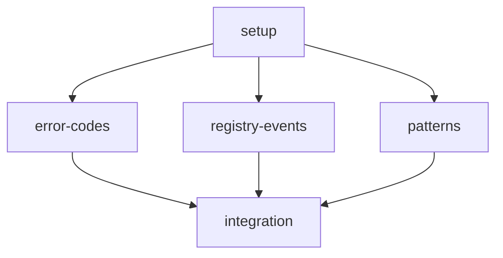

# Plan: Constants Feature

## Goal

Implement a Rust-idiomatic constants module providing error codes (as an enum with `Display`/`FromStr`), registry event names, and a module ID validation regex, matching all 18 error codes from the Python reference.

## Architecture Design

### Component Structure

```
src/constants.rs
  ├── ErrorCode          — enum with 18 variants, derives Display/FromStr via strum
  ├── RegistryEvent      — enum with Display/FromStr for REGISTER/UNREGISTER
  ├── MODULE_ID_PATTERN  — &str regex constant
  └── module_id_regex()  — helper returning compiled Regex (cached via LazyLock)
```

### Data Flow

Constants are consumed read-only by other modules. `ErrorCode` and `RegistryEvent` serialize to/from their wire-format string representations (e.g., `"MODULE_NOT_FOUND"`, `"register"`) so they can be embedded in JSON messages and matched against incoming protocol strings.

### Technology Choices

| Choice | Rationale |
|--------|-----------|
| `ErrorCode` enum (not `&[&str]`) | Compile-time exhaustiveness checks; `match` arms catch missing cases; `Display`/`FromStr` give free string conversion |
| `strum` derive macros | Zero-boilerplate `Display`, `FromStr`, `EnumIter`, `IntoStaticStr` for enums |
| `serde` Serialize/Deserialize on enums | Wire-format compat: `#[serde(rename_all = "SCREAMING_SNAKE_CASE")]` emits the same strings as Python `ERROR_CODES` dict keys |
| `RegistryEvent` enum | Two variants; enum is clearer than a HashMap for a fixed set |
| `regex::Regex` + `LazyLock` | Compile pattern once, reuse across threads; `LazyLock` is std (edition 2021, Rust 1.80+) |
| `MODULE_ID_PATTERN` as `&str` | Kept as raw pattern string for consumers that need the pattern itself (e.g., schema annotations) |

### Key Design Decisions

1. **Regex quantifier**: Python uses `(\.[a-z][a-z0-9_]*)*` (zero or more dot-segments, so a bare `foo` is valid). The current Rust stub uses `+` (requires at least one dot). The Python behavior is authoritative -- switch to `*`.
2. **Error codes as enum**: Each Python dict key becomes an enum variant. `serde` rename ensures the serialized form is the SCREAMING_SNAKE_CASE string expected on the wire.
3. **RegistryEvent values**: Python maps `"REGISTER" -> "register"` and `"UNREGISTER" -> "unregister"`. In Rust the enum variant names are `Register`/`Unregister`; `Display` emits the lowercase wire value (`"register"`/`"unregister"`), and a `key()` method returns the uppercase protocol key if needed.

## Task Breakdown

### Dependency Graph



### Task List

| Task ID | Description | Est. Time | Dependencies |
|---------|-------------|-----------|--------------|
| setup | Add `strum` dependency, clean up existing stub, set up test scaffolding | 10 min | none |
| error-codes | Implement `ErrorCode` enum with all 18 variants, `Display`/`FromStr`/`Serialize`/`Deserialize` | 20 min | setup |
| registry-events | Implement `RegistryEvent` enum with `Register`/`Unregister` variants | 10 min | setup |
| patterns | Define `MODULE_ID_PATTERN` constant and `module_id_regex()` helper with `LazyLock` | 10 min | setup |
| integration | Cross-cutting integration tests: round-trip serde, regex validation, exhaustiveness | 15 min | error-codes, registry-events, patterns |

**Total estimated time: ~65 minutes**

## Risks and Considerations

| Risk | Mitigation |
|------|------------|
| `strum` version compatibility | Pin to `strum = "0.26"` / `strum_macros = "0.26"` which support current derive syntax |
| Regex quantifier mismatch (`+` vs `*`) | Align with Python reference (`*`); add explicit tests for single-segment IDs like `"core"` |
| Future error code additions | `#[non_exhaustive]` on `ErrorCode` prevents downstream `match` from breaking when new variants are added |
| Wire-format drift between Python and Rust | Integration tests assert that every Python error code string round-trips through `ErrorCode::from_str` |

## Acceptance Criteria

- [ ] `ErrorCode` enum contains all 18 codes from the Python implementation
- [ ] `ErrorCode` round-trips through `Display`/`FromStr` and `serde_json` for every variant
- [ ] `RegistryEvent::Register` displays as `"register"`, `RegistryEvent::Unregister` as `"unregister"`
- [ ] `MODULE_ID_PATTERN` matches valid module IDs (e.g., `"image.resize"`, `"core"`)
- [ ] `MODULE_ID_PATTERN` rejects invalid IDs (uppercase, special chars, leading digits, empty string)
- [ ] `module_id_regex()` returns a compiled `Regex` that is safe to call from multiple threads
- [ ] All existing code that imports from `constants` still compiles
- [ ] `cargo test` passes with no warnings
- [ ] `cargo clippy` reports no warnings

## References

- Feature spec: `docs/features/constants.md`
- Python reference: `apcore-mcp-python/src/apcore_mcp/constants.py`
- Type mapping spec: `apcore/docs/spec/type-mapping.md` (section 5 -- enum mappings)
- Rust stub: `src/constants.rs`
