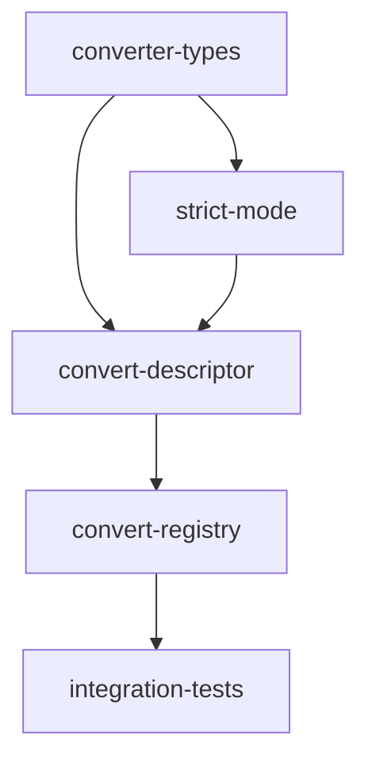

# Converters Feature — Implementation Plan

## Goal

Implement the `OpenAIConverter` that converts apcore module registries and descriptors to OpenAI function-calling tool format, enabling interop with OpenAI-compatible APIs.

## Architecture Design

### Component Structure

```
src/converters/
  mod.rs              # Re-exports public API
  openai.rs           # OpenAIConverter
```

The converter is a stateless struct that composes three adapter components (`SchemaConverter`, `AnnotationMapper`, `ModuleIDNormalizer`) and adds OpenAI-specific strict mode logic.

### Data Flow

```
Registry ──► list(tags, prefix) ──► Vec<module_id>
                                         │
                                         ▼
                              get_definition(module_id)
                                         │
                                         ▼
                               ModuleDescriptor
                                         │
                  ┌──────────────────────┼──────────────────────┐
                  ▼                      ▼                      ▼
        ModuleIDNormalizer      SchemaConverter       AnnotationMapper
          (dot → dash)       (input_schema → params)  (→ desc suffix)
                  │                      │                      │
                  └──────────────────────┼──────────────────────┘
                                         ▼
                              OpenAI tool definition
                              {type: "function", function: {name, description, parameters, strict?}}
```

### Key Design Decisions

| Decision | Rationale |
|----------|-----------|
| `OpenAIConverter` holds adapter instances (not static calls) | Matches Python design; allows future configuration injection (e.g., custom normalizers). Even though current adapters are stateless, instance composition enables testability via future trait extraction. |
| Strict mode as a local `_apply_strict_mode` method | The Python implementation delegates to `apcore.schema.strict.to_strict_schema()`. The apcore Rust crate does NOT expose `to_strict_schema()` or `_apply_llm_descriptions()` as public functions — it only has `SchemaExporter::export_openai()` which hardcodes `strict: true`. We must implement the strict mode algorithm locally in the converter. |
| `&Registry` as concrete type (not trait) | The apcore Rust `Registry` is a concrete struct, not a trait. Unlike the Python duck-typed approach, we reference the apcore `Registry` directly. |
| `ModuleDescriptor.name` maps to Python's `descriptor.module_id` | The Rust apcore crate uses `name` where Python uses `module_id`. The converter must use `descriptor.name`. |
| Description sourced from `Module::description()` | `ModuleDescriptor` in Rust does not have a `description` field. Description must be retrieved from the `Module` trait or passed separately. For `convert_descriptor`, we accept description as a separate parameter or extract from registry context. |
| Return `Vec<Value>` (not typed struct) | Matches the existing stub API and keeps the output flexible for serialization without requiring a new struct definition. |

### Strict Mode Algorithm (Local Implementation)

Since `apcore-rust` does not expose `to_strict_schema()` as a public function, we implement Algorithm A23 locally:

1. Deep-clone the input schema
2. `apply_llm_descriptions`: Recursively replace `description` with `x-llm-description` where both exist
3. `strip_extensions`: Recursively remove all `x-*` keys and `default` keys
4. `convert_to_strict`: For each object with `properties`:
   - Set `additionalProperties: false`
   - Identify optional properties (not in existing `required`)
   - Make optional properties nullable (add `"null"` to type, or wrap in `oneOf` with null)
   - Set `required` to sorted list of all property names
5. Recurse into `properties`, `items`, `oneOf`/`anyOf`/`allOf`, `$defs`/`definitions`

### Error Handling Strategy

The converter methods return `Vec<Value>` (for registry) and `Value` (for descriptor). Errors from adapter components (`AdapterError` from `SchemaConverter`, `ModuleIDNormalizer`) should be propagated. Define converter methods to return `Result<_, ConverterError>`:

```rust
#[derive(Debug, thiserror::Error)]
pub enum ConverterError {
    #[error("adapter error: {0}")]
    Adapter(#[from] crate::adapters::AdapterError),
    #[error("strict mode conversion failed: {0}")]
    StrictMode(String),
}
```

## Task Breakdown

### Dependency Graph



### Task List

| Task ID | Title | Est. Time | Dependencies |
|---------|-------|-----------|--------------|
| converter-types | Define ConverterError, OpenAIConverter struct, and module exports | 1h | none |
| strict-mode | Implement strict mode algorithm (apply_llm_descriptions, strip_extensions, convert_to_strict) | 2h | converter-types |
| convert-descriptor | Implement convert_descriptor with ID normalization, schema conversion, annotations, and strict mode | 2h | converter-types, strict-mode |
| convert-registry | Implement convert_registry with tag/prefix filtering and descriptor iteration | 1h | convert-descriptor |
| integration-tests | End-to-end tests with mock Registry, roundtrip verification | 1h | convert-registry |

**Total estimated time: ~7 hours**

## Risks and Considerations

### Technical Challenges

1. **No public `to_strict_schema()` in apcore-rust**: The Python converter imports `to_strict_schema` and `_apply_llm_descriptions` from `apcore.schema.strict`. The Rust `apcore` crate only has `SchemaExporter::export_openai()` which is a high-level method that doesn't expose the strict transformation primitives. We must reimplement the strict mode algorithm locally. This creates a maintenance risk if the algorithm changes in `apcore`. Consider upstreaming the functions to `apcore-rust` in a future PR.

2. **Description field mismatch**: Python's `ModuleDescriptor` has a `description` field. Rust's `ModuleDescriptor` does not — description lives on the `Module` trait. The converter must either: (a) accept description as a parameter, (b) take both the `ModuleDescriptor` and a `&dyn Module` reference, or (c) accept a wrapper struct. Option (a) is simplest and most flexible.

3. **Registry access pattern**: Python's `registry.list()` returns module IDs and `registry.get_definition()` returns descriptors. The Rust `Registry` has matching methods (`list()` returns `Vec<&str>`, `get_definition()` returns `Option<&ModuleDescriptor>`). However, getting the description requires calling `Module::description()`, which means the converter also needs access to the registered module, not just its descriptor.

4. **Ownership and borrowing**: The `Registry` methods return references (`&str`, `&ModuleDescriptor`). The converter must clone or borrow appropriately. Since the output `Value` objects are owned, cloning descriptors/schemas is expected.

### Testing Considerations

- Unit tests for strict mode transformations can be tested independently with JSON fixtures
- `convert_descriptor` tests need mock descriptors (simple `serde_json::json!()` values)
- `convert_registry` tests need a real or mock `Registry` — consider constructing one in test setup
- Integration tests should verify output matches Python reference implementation for shared fixtures

## Acceptance Criteria

- [ ] Converts apcore descriptors to OpenAI function format: `{type: "function", function: {name, description, parameters}}`
- [ ] Uses `ModuleIDNormalizer` to convert dot-notation to dashes
- [ ] Embeds annotations in description when `embed_annotations=true`
- [ ] Applies strict mode using local implementation of Algorithm A23 when `strict=true`
- [ ] Strict mode sets `additionalProperties: false` on all objects
- [ ] Strict mode makes all properties required (sorted alphabetically)
- [ ] Strict mode makes optional properties nullable
- [ ] Strict mode strips `x-*` extensions and `default` values
- [ ] Strict mode promotes `x-llm-description` to `description`
- [ ] Filters by tags when tags are specified
- [ ] Applies prefix to tool names when prefix is specified
- [ ] Skips modules where `get_definition` returns `None` (race condition)
- [ ] All public types derive `Debug`, `Clone` where appropriate
- [ ] All modules have doc comments and `#[cfg(test)]` unit test modules
- [ ] `cargo test` passes with no warnings
- [ ] `cargo clippy` passes with no warnings

## References

- Feature spec: `docs/features/converters.md`
- Python reference: `apcore-mcp-python/src/apcore_mcp/converters/openai.py`
- Python strict mode: `apcore-python/src/apcore/schema/strict.py`
- Rust stub: `src/converters/openai.rs`
- Rust adapters: `src/adapters/` (SchemaConverter, AnnotationMapper, ModuleIDNormalizer)
- Rust apcore registry: `apcore-rust/src/registry/registry.rs` (Registry, ModuleDescriptor)
- Rust apcore module: `apcore-rust/src/module.rs` (Module trait, ModuleAnnotations)
- Rust apcore exporter: `apcore-rust/src/schema/exporter.rs` (SchemaExporter — reference only)
