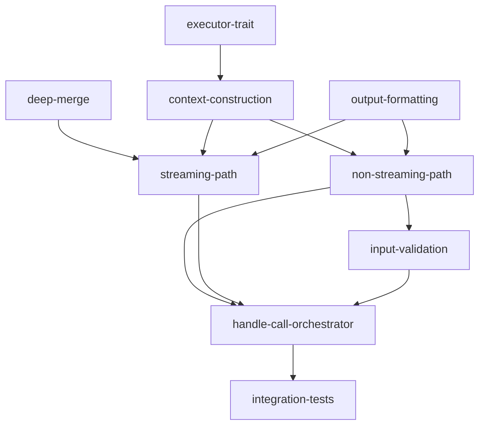

# Execution Router Feature — Implementation Plan

## Goal

Implement `ExecutionRouter` that routes MCP tool call requests to the apcore executor, handling input validation, dual-path execution (streaming vs non-streaming), output formatting, error mapping, progress reporting, elicitation support, and per-call context construction — matching the Python reference behavior with idiomatic Rust async patterns.

## Architecture Design

### Component Structure

```
src/server/router.rs
├── Constants: DEEP_MERGE_MAX_DEPTH (32)
├── Types
│   ├── ContentItem (struct: content_type + data)
│   ├── HandleCallResult (type alias: (Vec<ContentItem>, bool, Option<String>))
│   ├── OutputFormatter (type alias: Box<dyn Fn(&Value) -> String + Send + Sync>)
│   └── SendNotification (type alias: async callback for MCP notifications)
├── Free Functions
│   └── deep_merge(base, overlay, depth) -> Value
├── ExecutionRouter (struct)
│   ├── new(executor, validate_inputs, output_formatter)
│   ├── handle_call(tool_name, arguments, extra) -> HandleCallResult
│   ├── handle_call_async(tool_name, arguments, context) -> HandleCallResult  [private]
│   ├── handle_stream(tool_name, arguments, progress_token, send_notification, context) -> HandleCallResult  [private]
│   ├── format_result(result) -> String  [private]
│   └── build_error_text(error_info) -> String  [private static]
└── Tests (unit + integration)
```

### Data Flow

```
MCP call_tool request
    │
    ▼
ExecutionRouter::handle_call(tool_name, arguments, extra)
    │
    ├── Extract progress_token, send_notification, session from extra
    ├── Build Context with callbacks (progress, elicit) + identity
    ├── Optional: validate inputs via executor.validate()
    │
    ├── [streaming path] executor has stream() AND progress_token + send_notification present
    │   └── handle_stream() → iterate async stream, send progress notifications, deep_merge chunks
    │
    └── [non-streaming path]
        └── handle_call_async() → executor.call_async()
    │
    ▼
(Vec<ContentItem>, is_error: bool, trace_id: Option<String>)
```

### Technology Choices with Rationale

| Choice | Rationale |
|--------|-----------|
| `serde_json::Value` for arguments and results | Arguments are dynamic JSON from MCP; no compile-time shape available |
| `async_trait` for executor trait | The executor interface is object-safe; `async_trait` enables `dyn Executor` usage |
| `Pin<Box<dyn Stream<Item = Value> + Send>>` for streaming | Standard Rust pattern for async streaming; mirrors Python's `async for chunk in stream_iter` |
| `tokio_stream::Stream` trait | Project already depends on `tokio`; `tokio-stream` is the canonical companion |
| Recursive `deep_merge` on `Value` with depth cap | Direct port of Python's `_deep_merge` with `_DEEP_MERGE_MAX_DEPTH = 32`; operates on `serde_json::Value::Object` |
| `Box<dyn Fn(&Value) -> String + Send + Sync>` for output formatter | Matches Python's `Callable[[dict], str]`; boxed trait object for runtime polymorphism |
| `ErrorMapper` from `adapters::errors` | Reuse existing error mapping; avoid duplication |
| `tracing` for logging | Project standard; structured logging with `tracing::debug!` / `tracing::error!` |
| `HashMap<String, Box<dyn Any + Send + Sync>>` for context data | Matches the helpers module's callback injection pattern (see `planning/helpers/plan.md`) |

### Executor Trait Design

The Python implementation duck-types the executor. In Rust, define an explicit `Executor` trait:

```rust
#[async_trait]
pub trait Executor: Send + Sync {
    /// Non-streaming execution.
    async fn call_async(
        &self,
        module_id: &str,
        inputs: &Value,
        context: Option<&Context>,
    ) -> Result<Value, ExecutorError>;

    /// Streaming execution (optional).
    /// Returns None if streaming is not supported.
    fn stream(
        &self,
        module_id: &str,
        inputs: &Value,
        context: Option<&Context>,
    ) -> Option<Pin<Box<dyn Stream<Item = Result<Value, ExecutorError>> + Send>>>;

    /// Input validation (optional).
    /// Returns None if validation is not supported.
    fn validate(
        &self,
        module_id: &str,
        inputs: &Value,
        context: Option<&Context>,
    ) -> Option<ValidationResult>;
}
```

This replaces Python's runtime introspection (`_check_accepts_context`) with compile-time trait methods that always accept an `Option<&Context>`.

### Context Construction

The router builds a per-call `Context` by:
1. Creating a `HashMap<String, Box<dyn Any + Send + Sync>>` for `data`
2. Injecting a `ProgressCallback` under `MCP_PROGRESS_KEY` when `progress_token` + `send_notification` are available
3. Injecting an `ElicitCallback` under `MCP_ELICIT_KEY` when `session` is available
4. Passing `identity` from `extra` to `Context::create(data, identity)`

This mirrors the Python `Context.create(data=callbacks, identity=identity)` pattern.

### Deep Merge Strategy

Port Python's `_deep_merge` to operate on `serde_json::Value`:
- Only merges `Value::Object` (maps); all other types are overwritten
- Recursion depth capped at 32 (flat merge beyond that)
- Returns a new `Value` (no in-place mutation, matching Python's immutable approach)

### Error Handling Strategy

- `handle_call` never returns `Err`; errors are mapped to `(content, is_error=true, None)` tuples
- Executor errors are caught and mapped via `ErrorMapper::to_mcp_error`
- Validation failures produce a descriptive text content item
- Internal panics in callbacks are caught via the error mapping path (not `catch_unwind`)

## Task Breakdown

### Dependency Graph



### Task List

| Task ID | Title | Est. Time | Dependencies |
|---------|-------|-----------|--------------|
| executor-trait | Define Executor trait with call_async, stream, validate methods | 1.5h | none |
| deep-merge | Implement deep_merge for serde_json::Value with depth cap | 1h | none |
| output-formatting | Implement output formatter with default JSON fallback | 45min | none |
| context-construction | Build per-call Context with progress and elicit callbacks | 2h | executor-trait |
| non-streaming-path | Implement _handle_call_async with error mapping | 1.5h | context-construction, output-formatting |
| streaming-path | Implement _handle_stream with progress notifications and deep merge | 2h | context-construction, output-formatting, deep-merge |
| input-validation | Implement pre-execution validation when validate_inputs is true | 1h | non-streaming-path |
| handle-call-orchestrator | Wire handle_call to select streaming vs non-streaming path | 1.5h | non-streaming-path, streaming-path, input-validation |
| integration-tests | End-to-end tests with mock executor covering both paths | 2h | handle-call-orchestrator |

**Total estimated time: ~13 hours**

## Risks and Considerations

### Technical Challenges

1. **Executor trait object-safety**: The `stream` method returns `Pin<Box<dyn Stream>>` which is object-safe. The `call_async` method uses `async_trait` to be object-safe. Ensure all methods are dispatchable through `dyn Executor`.

2. **Async stream iteration**: Rust's `Stream` trait requires `tokio-stream` or `futures-core`. The project does not currently list `tokio-stream` in `Cargo.toml` — it must be added. Alternatively, use `futures-core::Stream` which is re-exported by `tokio-stream`.

3. **Callback closure captures**: The progress callback captures `progress_token` (clone of `String` or `i64`) and `send_notification` (`Arc<dyn Fn(...)>`). The elicit callback captures `session` (`Arc<dyn ...>`). All captures must be `Send + Sync` for the context data map.

4. **Python's `_check_accepts_context` introspection**: Python inspects method signatures at runtime. In Rust, the trait always includes `Option<&Context>`, eliminating this entirely. This is a deliberate simplification.

5. **`send_notification` callback type**: The Python code receives `send_notification` as a callable. In Rust, this should be `Arc<dyn Fn(Value) -> Pin<Box<dyn Future<Output = Result<(), Error>> + Send>> + Send + Sync>`. This type is verbose; define a type alias `SendNotificationFn`.

6. **tokio-stream dependency**: Must add `tokio-stream = "0.1"` to `Cargo.toml` or use `futures-core` for the `Stream` trait. `tokio-stream` is preferred since the project already uses `tokio`.

7. **Context type availability**: The `Context` type comes from the `apcore` crate. If `Context::create(data, identity)` is not yet implemented in the Rust `apcore` crate, the context construction task will need to adapt or stub it.

### Testing Considerations

- The `Executor` trait enables clean mock implementations for testing
- Deep merge needs edge case tests: empty objects, nested 33+ levels, non-object values, mixed types
- Streaming path needs tests with 0 chunks, 1 chunk, multiple chunks, and error mid-stream
- Validation path needs tests with valid inputs, invalid inputs, and missing validate() support
- Progress notification tests should verify the notification JSON structure matches MCP spec
- Error mapping tests should verify AI guidance fields are included when present

## Acceptance Criteria

- [ ] `ExecutionRouter::new` accepts executor, validate_inputs, and optional output_formatter
- [ ] `ExecutionRouter::handle_call` returns `(Vec<ContentItem>, bool, Option<String>)` tuple
- [ ] Routes tool calls to executor by module_id
- [ ] Maps MCP arguments to apcore execution context
- [ ] Handles progress reporting via MCP notifications when progress_token is present
- [ ] Activates streaming path when executor supports stream() and progress_token + send_notification present
- [ ] Formats output using output_formatter (default: JSON via `serde_json::to_string`)
- [ ] Maps errors to MCP error responses via ErrorMapper
- [ ] Validates inputs when validate_inputs is true
- [ ] Returns trace_id from context when available
- [ ] Passes identity from auth context to executor via Context
- [ ] Supports elicitation via MCP session callback
- [ ] Deep merge of stream chunks is capped at depth 32
- [ ] `Executor` trait is object-safe and supports `dyn Executor`
- [ ] All public types derive `Debug`, `Clone` where appropriate
- [ ] All modules have doc comments and `#[cfg(test)]` unit test modules
- [ ] `cargo test` passes with no warnings
- [ ] `cargo clippy` passes with no warnings

## References

- Feature spec: `docs/features/execution-router.md`
- Type mapping spec: `apcore/docs/spec/type-mapping.md` (Rust column)
- Python reference: `apcore-mcp-python/src/apcore_mcp/server/router.py`
- Existing Rust stub: `src/server/router.rs`
- Error mapper: `src/adapters/errors.rs`
- Helpers module: `src/helpers.rs` (callback types, `MCP_PROGRESS_KEY`, `MCP_ELICIT_KEY`)
- Helpers plan: `planning/helpers/plan.md`
- Adapters plan: `planning/adapters/plan.md`
