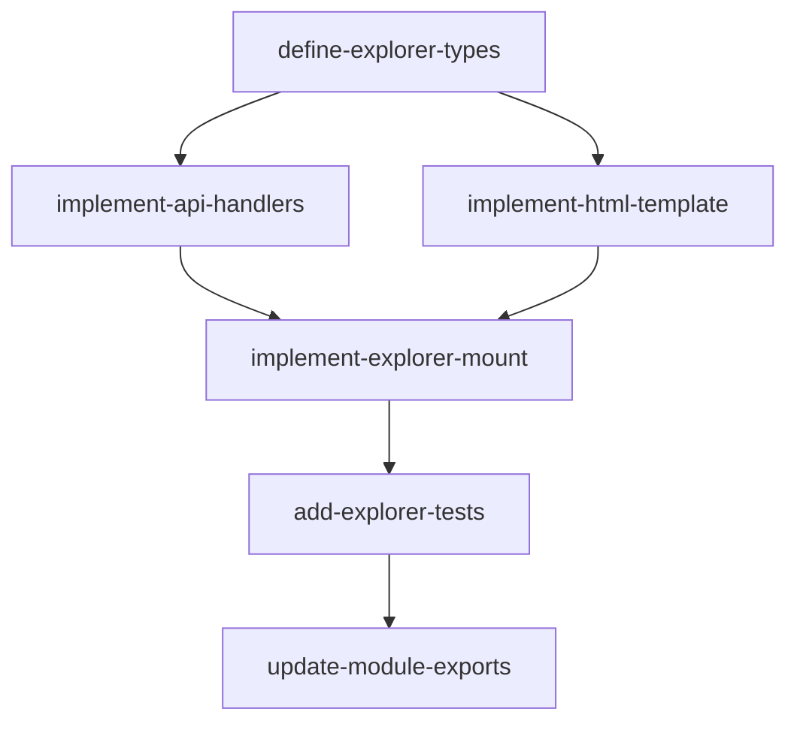

# Explorer Feature — Implementation Plan

## Goal

Port the Python `explorer` module to idiomatic Rust. The module mounts a web UI at a configurable prefix (default `/explorer`) that lists registered MCP tools with their schemas and optionally allows tool execution. In Python this delegates to the `mcp-embedded-ui` library; in Rust we build equivalent axum routes that serve embedded HTML and a JSON API, with an optional auth hook that bridges the `AUTH_IDENTITY` task-local for tool execution.

## Architecture Design

### Component Structure

```
src/explorer/
  mod.rs          — public re-exports
  mount.rs        — create_explorer_mount(), ExplorerConfig, auth hook, axum Router
  templates.rs    — embedded HTML template (inline or include_str!)
  api.rs          — JSON API handlers: GET /tools, POST /tools/:name/call
```

### Data Flow

```
Browser request
  |
  v
axum Router (nested at explorer_prefix)
  |-- GET /               -> serve explorer HTML page
  |-- GET /tools          -> list tools as JSON (name, description, inputSchema)
  |-- POST /tools/:name/call  (only if allow_execute)
  |     |-- if authenticator: extract Bearer, authenticate, set AUTH_IDENTITY task-local
  |     |-- call ExecutionRouter::handle_call
  |     |-- return JSON result
  |
  v
Response
```

### Technology Choices

| Concern | Choice | Rationale |
|---------|--------|-----------|
| HTTP framework | axum 0.8 | Already in Cargo.toml; native Router nesting |
| HTML serving | `include_str!` embedded template | No external crate needed; single-page UI |
| JSON API | axum extractors + `serde_json` | Already available; idiomatic |
| Auth bridge | `AUTH_IDENTITY` task-local from `auth::middleware` | Matches Python `auth_identity_var` pattern |
| Tool metadata | `serde_json::Value` for input schemas | Matches MCP tool schema format |
| Async | tokio | Already in use throughout the project |

### Key Design Decisions

1. **No external embedded-UI crate.** Unlike Python's `mcp-embedded-ui`, there is no equivalent Rust crate. We embed a minimal HTML page using `include_str!` and serve it from the axum router. The page uses vanilla JS to call the `/tools` API and render results.

2. **`ExplorerConfig` struct for all options.** Collects `allow_execute`, `explorer_prefix`, `authenticator`, `title`, `project_name`, `project_url` into a builder-friendly struct. `create_explorer_mount` consumes this config.

3. **Auth hook as optional `Arc<dyn Authenticator>`.** When provided, the POST `/tools/:name/call` handler extracts the Bearer token, authenticates, and wraps the execution future in `AUTH_IDENTITY.scope()`. On auth failure, returns 401 JSON. GET endpoints do not require auth.

4. **Tools passed as serialized metadata.** The function accepts `Vec<ToolInfo>` where `ToolInfo` contains `name`, `description`, and `input_schema` as `serde_json::Value`. This avoids coupling to the MCP server's internal tool representation.

5. **Execution via a callback, not direct `ExecutionRouter` dependency.** The mount accepts a boxed async callback `HandleCallFn` for tool execution. This keeps the explorer decoupled from the router implementation, matching the Python pattern where `_handle_call` is a closure.

## Task Breakdown

### Dependency Graph



### Task List

| Task ID | Title | Est. Time | Dependencies |
|---------|-------|-----------|--------------|
| define-explorer-types | Define ExplorerConfig, ToolInfo, HandleCallFn types | 45 min | none |
| implement-html-template | Create embedded HTML/JS explorer page | 1 hr | none |
| implement-api-handlers | Implement GET /tools and POST /tools/:name/call handlers | 1.5 hr | define-explorer-types |
| implement-explorer-mount | Wire create_explorer_mount with config, auth hook, and Router nesting | 1.5 hr | implement-api-handlers, implement-html-template |
| add-explorer-tests | Unit and integration tests for all endpoints | 1.5 hr | implement-explorer-mount |
| update-module-exports | Clean up mod.rs, remove stubs, verify public API | 20 min | add-explorer-tests |

**Total estimated time: ~6 hours 35 minutes**

## Risks and Considerations

1. **No `mcp-embedded-ui` equivalent.** We must build the HTML UI from scratch. Keep it minimal — a single page with JS that fetches `/tools` and renders a list. Tool execution form can be basic (JSON textarea + submit).

2. **Auth hook scoping.** The `AUTH_IDENTITY` task-local must wrap only the execution future, not the entire request. Use `AUTH_IDENTITY.scope(Some(identity), execution_future).await` inside the POST handler.

3. **`ExecutionRouter` is still a stub.** The `handle_call` method on `ExecutionRouter` is `todo!()`. The explorer mount should accept a callback so it can be tested independently with a mock. Integration with the real router is a separate concern.

4. **CORS for embedded UI.** Since the UI is served from the same origin, CORS should not be needed. If the explorer is accessed cross-origin, the existing `tower-http` CORS layer can be applied at the app level.

5. **Static asset caching.** The embedded HTML is compiled into the binary. Consider setting `Cache-Control` headers so browsers cache the page but always revalidate the API.

## Acceptance Criteria

- [ ] Creates a web UI mount at the specified prefix
- [ ] Lists all available MCP tools with descriptions and schemas
- [ ] Supports optional tool execution when `allow_execute=true`
- [ ] Bridges auth via `AUTH_IDENTITY` task-local when authenticator is provided
- [ ] Configurable title, project name, and project URL
- [ ] Default prefix is `/explorer`
- [ ] GET `/` returns HTML page
- [ ] GET `/tools` returns JSON array of tool metadata
- [ ] POST `/tools/:name/call` executes tool and returns JSON result (only when allowed)
- [ ] POST returns 403 when `allow_execute=false`
- [ ] POST returns 401 when authenticator is set and token is missing/invalid
- [ ] All `#![allow(unused)]` directives removed
- [ ] All `todo!()` macros replaced with real implementations
- [ ] Unit tests cover: tool listing, tool execution, auth required, auth missing, execution disabled
- [ ] Code compiles with no warnings

## References

- Feature spec: `docs/features/explorer.md`
- Python reference: `apcore-mcp-python/src/apcore_mcp/explorer/__init__.py`
- Auth middleware: `src/auth/middleware.rs` (AUTH_IDENTITY task-local)
- Execution router: `src/server/router.rs` (handle_call signature)
- axum nested routers: https://docs.rs/axum/0.8/axum/struct.Router.html#method.nest
