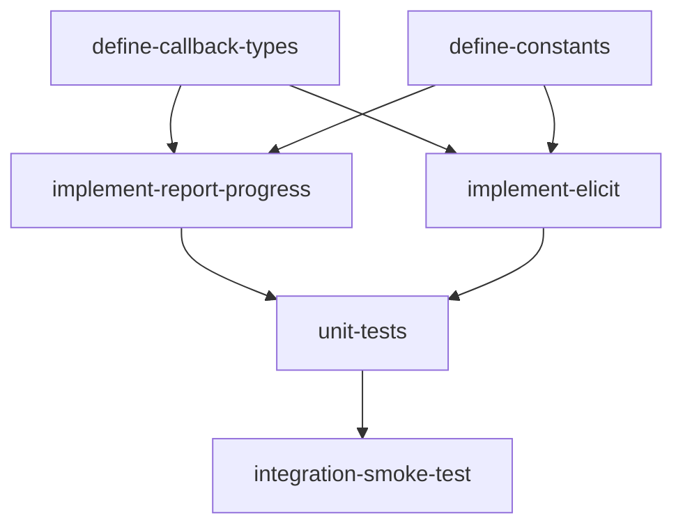

# Helpers Feature — Implementation Plan

## Goal

Implement Rust-native MCP helper functions (`report_progress` and `elicit`) that read async callbacks from an execution context and gracefully no-op when callbacks are absent, matching the Python reference behavior with idiomatic Rust patterns.

## Architecture Design

### Component Structure

```
src/helpers.rs
├── Constants: MCP_PROGRESS_KEY, MCP_ELICIT_KEY
├── Types
│   ├── ElicitAction (enum: Accept, Decline, Cancel)
│   ├── ElicitResult (struct: action + optional content)
│   ├── ProgressCallback (type alias for async fn trait object)
│   └── ElicitCallback (type alias for async fn trait object)
├── Functions
│   ├── report_progress(context, progress, total, message) -> ()
│   └── elicit(context, message, requested_schema) -> Option<ElicitResult>
└── Tests (unit + integration)
```

### Data Flow

1. The `ExecutionRouter` (in `src/server/router.rs`) injects callback closures into the context's `data` HashMap under well-known keys (`_mcp_progress`, `_mcp_elicit`).
2. Module `execute()` calls `report_progress()` or `elicit()`, passing the context.
3. The helper functions extract the callback from `context.data` using the constant keys.
4. If the callback exists, it is invoked asynchronously; if absent, the function returns silently (no-op for progress) or `None` (for elicit).

### Technology Choices

| Decision | Choice | Rationale |
|----------|--------|-----------|
| Callback storage | `HashMap<String, Box<dyn Any + Send + Sync>>` in context data | Matches Python's dynamic `data` dict; `Any` allows type-safe downcast at retrieval |
| Callback type (progress) | `Box<dyn Fn(f64, Option<f64>, Option<String>) -> Pin<Box<dyn Future<Output = ()> + Send>> + Send + Sync>` | Async callable trait object; `Send + Sync` for tokio multi-thread runtime |
| Callback type (elicit) | `Box<dyn Fn(String, Option<Value>) -> Pin<Box<dyn Future<Output = Option<ElicitResult>> + Send>> + Send + Sync>` | Same pattern; returns `Option<ElicitResult>` |
| Serialization | `serde` + `serde_json` | Already in Cargo.toml; needed for `ElicitResult` and `Value` handling |
| Enum variant casing | `#[serde(rename_all = "snake_case")]` on `ElicitAction` | Matches MCP protocol wire format ("accept", "decline", "cancel") |
| Error handling | No-op / `None` return (no `Result`) | Mirrors Python's graceful degradation; helpers must never cause execution failure |
| Async runtime | `tokio` | Project standard; callbacks are `.await`-ed |

### Context Integration

The helpers depend on a context type that exposes a `data` field. The current stub uses `&Value` as a placeholder. The implementation must use the actual context type from the `apcore` crate (or a trait that provides `fn data(&self) -> &HashMap<String, Box<dyn Any + Send + Sync>>`). This will be resolved during implementation based on the apcore crate's `Context` type.

## Task Breakdown

### Dependency Graph



### Task List

| Task ID | Title | Est. Time | Dependencies |
|---------|-------|-----------|--------------|
| define-callback-types | Define callback type aliases and update ElicitAction/ElicitResult types | 30 min | none |
| define-constants | Define MCP_PROGRESS_KEY and MCP_ELICIT_KEY constants | 10 min | none |
| implement-report-progress | Implement `report_progress` with context callback lookup and no-op fallback | 45 min | define-callback-types, define-constants |
| implement-elicit | Implement `elicit` with context callback lookup and None fallback | 45 min | define-callback-types, define-constants |
| unit-tests | Write unit tests for all types, both functions (with and without callbacks) | 60 min | implement-report-progress, implement-elicit |
| integration-smoke-test | End-to-end smoke test verifying helpers work in a mock MCP execution flow | 30 min | unit-tests |

**Total estimated time: ~3.5 hours**

## Risks and Considerations

### Technical Challenges

1. **Context type coupling**: The helpers must extract callbacks from the context's data map. If the `apcore` crate's `Context` type does not yet support `HashMap<String, Box<dyn Any + Send + Sync>>` for its `data` field, this will need to be added or adapted. Mitigation: define a `ContextDataAccess` trait that the context type can implement, decoupling helpers from a concrete context struct.

2. **Async callback ergonomics**: Rust does not have native `async` closures (stable). The callback must return `Pin<Box<dyn Future<Output = T> + Send>>`. This is verbose but well-established. Mitigation: define type aliases (`ProgressCallback`, `ElicitCallback`) to reduce boilerplate.

3. **Downcasting from `Any`**: Extracting a typed callback from `Box<dyn Any>` requires `downcast_ref`, which can fail at runtime if the type doesn't match. Mitigation: use the exact same type alias when storing and retrieving; add debug-level tracing on downcast failure.

4. **Send + Sync bounds**: Callbacks stored in the context must be `Send + Sync` for use across tokio tasks. This constrains what closures can be used as callbacks. Mitigation: document the requirement; the MCP server layer already operates in a `Send + Sync` world.

5. **No error propagation by design**: Both helpers intentionally swallow errors (matching Python). If a callback panics, it will propagate up. Mitigation: consider wrapping callback invocation in `std::panic::catch_unwind` or `tokio::task::catch_unwind` with tracing, though this may be deferred as a follow-up.

## Acceptance Criteria

- [ ] `MCP_PROGRESS_KEY` and `MCP_ELICIT_KEY` constants are defined and publicly exported
- [ ] `ElicitAction` enum has `Accept`, `Decline`, `Cancel` variants with `snake_case` serde serialization
- [ ] `ElicitResult` struct has `action: ElicitAction` and `content: Option<Value>` fields
- [ ] `ProgressCallback` and `ElicitCallback` type aliases are defined and exported
- [ ] `report_progress` reads the progress callback from context data using `MCP_PROGRESS_KEY`
- [ ] `report_progress` invokes the callback with (progress, total, message) when present
- [ ] `report_progress` silently no-ops when the callback is absent or context has no data
- [ ] `elicit` reads the elicit callback from context data using `MCP_ELICIT_KEY`
- [ ] `elicit` invokes the callback with (message, requested_schema) when present
- [ ] `elicit` returns `None` when the callback is absent or context has no data
- [ ] `ElicitResult` correctly maps action and optional content from callback response
- [ ] All public items have rustdoc comments
- [ ] Unit tests cover: types serialization, progress with callback, progress without callback, elicit with callback, elicit without callback, elicit with all three action variants
- [ ] Integration smoke test demonstrates end-to-end flow with mock context
- [ ] `cargo test` passes with no warnings
- [ ] `cargo clippy` passes with no warnings

## References

- Feature spec: `docs/features/helpers.md`
- Type mapping: `apcore/docs/spec/type-mapping.md` (Rust column)
- Python reference: `apcore-mcp-python/src/apcore_mcp/helpers.py`
- Existing Rust stub: `src/helpers.rs`
- apcore crate (context type): `../apcore-rust`
- MCP protocol: elicitation and progress notification specs
