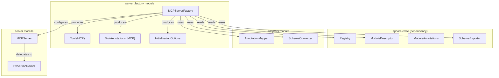
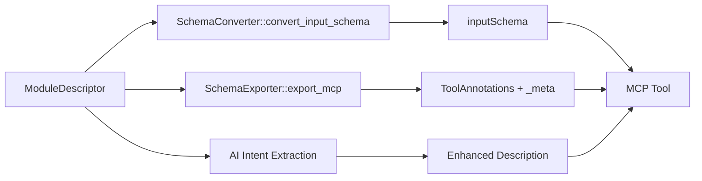
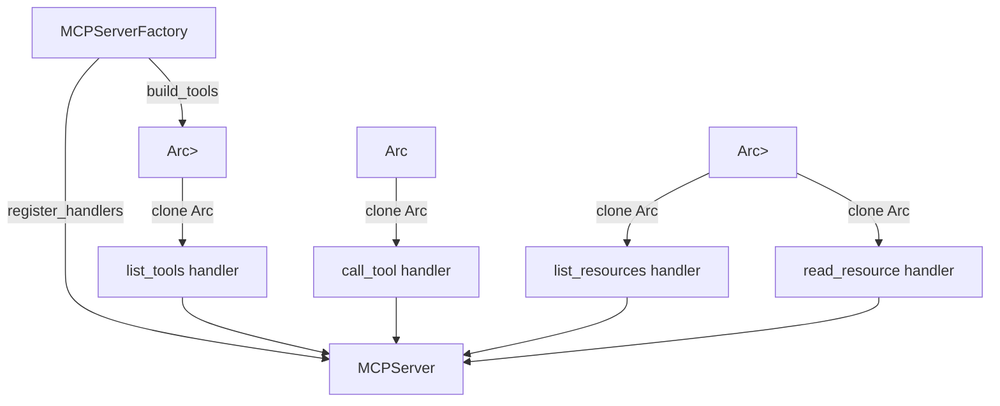

# Server Factory — Implementation Plan

## Goal

Port the Python `MCPServerFactory` to idiomatic Rust, providing the full adapter surface that converts apcore `Registry` + `ModuleDescriptor` data into MCP tool definitions, registers request handlers (list_tools, call_tool, list_resources, read_resource), and produces server initialization options. The implementation must preserve behavioral parity with the Python reference while leveraging Rust's type system, `Arc<Mutex<>>` for shared state, and the existing `apcore` crate types.

## Architecture Design

### Component Relationships

### Data Flow — build_tool

### Handler Registration — Arc/Mutex Pattern

## Task Breakdown

```mermaid
gantt
    title Server Factory Implementation
    dateFormat X
    axisFormat %s

    section Types
    mcp-types              :t1, 0, 3
    tool-annotations-type  :t2, 0, 2

    section Core Build
    build-tool             :t3, after t1 t2, 5
    ai-intent-metadata     :t4, after t3, 3
    build-tools            :t5, after t3, 3

    section Handlers
    register-handlers      :t6, after t5, 5
    register-resources     :t7, after t5, 4

    section Init
    init-options           :t8, after t6 t7, 2

    section Integration
    factory-integration    :t9, after t8, 3
```

| Task ID | Title | Estimate | Dependencies |
|---------|-------|----------|--------------|
| mcp-types | Define MCP tool/content types | ~2h | none |
| tool-annotations-type | ToolAnnotations struct and mapping | ~2h | none |
| build-tool | Implement build_tool from descriptor | ~4h | mcp-types, tool-annotations-type |
| ai-intent-metadata | AI intent key extraction and description enrichment | ~2h | build-tool |
| build-tools | Implement build_tools with tag/prefix filtering | ~2h | build-tool |
| register-handlers | Register list_tools and call_tool handlers | ~4h | build-tools |
| register-resources | Register resource handlers for documentation URIs | ~3h | build-tools |
| init-options | Build initialization options | ~1h | register-handlers, register-resources |
| factory-integration | End-to-end integration wiring | ~3h | init-options |

## Risks

| Risk | Impact | Mitigation |
|------|--------|------------|
| MCP SDK types not available as Rust crate | HIGH | Define local MCP types (Tool, ToolAnnotations, TextContent, Resource, etc.) as serde-compatible structs; swap for SDK types later |
| SchemaExporter.export_mcp in apcore-rust differs from Python | MED | The Rust `SchemaExporter::export_mcp` returns `{name, inputSchema}` only, lacks annotation mapping. Must extend or handle annotation mapping in factory directly using `AnnotationMapper` |
| Closure-based handler registration requires shared ownership | MED | Use `Arc<Vec<Tool>>` and `Arc<ExecutionRouter>` for handler closures; avoid `Mutex` unless mutation needed at handler call time |
| ModuleDescriptor lacks `module_id`, `documentation`, `metadata` fields | MED | Python's `descriptor.module_id` maps to Rust `ModuleDescriptor.name`; `documentation` and `metadata` fields need to be added to `ModuleDescriptor` or handled via extension traits |
| Progress token / session bridging differs in Rust async model | LOW | Use tokio task-local or pass context explicitly through the router's `extra` parameter |

## Acceptance Criteria

- [ ] `MCPServerFactory::new()` constructs with `SchemaConverter`, `AnnotationMapper`, `SchemaExporter`
- [ ] `build_tool()` converts `ModuleDescriptor` to MCP `Tool` with correct name (dot-notation), description, inputSchema, and annotations
- [ ] AI intent keys (`x-when-to-use`, `x-when-not-to-use`, `x-common-mistakes`, `x-workflow-hints`) are appended to tool descriptions when present in metadata
- [ ] `ToolAnnotations` maps `readOnlyHint`, `destructiveHint`, `idempotentHint`, `openWorldHint` from apcore annotations
- [ ] `_meta` includes `requiresApproval` and `streaming` when applicable
- [ ] `build_tools()` iterates registry with tag/prefix filtering, skips modules with no definition, logs warnings on errors
- [ ] `register_handlers()` installs `list_tools` and `call_tool` handlers using `Arc`-shared state
- [ ] `call_tool` handler delegates to `ExecutionRouter::handle_call` with progress token and identity bridging
- [ ] `register_resource_handlers()` exposes module documentation as `docs://{module_id}` resources
- [ ] `build_init_options()` returns correctly structured initialization options
- [ ] All public methods have unit tests written TDD-first
- [ ] Type mapping follows the cross-language type mapping spec (String, i64, f64, bool, Option<T>, Vec<T>, HashMap<String,V>)

## References

- Feature spec: `docs/features/server-factory.md`
- Python reference: `apcore-mcp-python/src/apcore_mcp/server/factory.py`
- Type mapping spec: `apcore/docs/spec/type-mapping.md`
- Rust Registry: `apcore-rust/src/registry/registry.rs` (`Registry`, `ModuleDescriptor`)
- Rust Module types: `apcore-rust/src/module.rs` (`ModuleAnnotations`)
- Rust SchemaExporter: `apcore-rust/src/schema/exporter.rs`
- Rust adapters: `src/adapters/annotations.rs`, `src/adapters/schema.rs`
- Rust server stub: `src/server/factory.rs`, `src/server/server.rs`, `src/server/router.rs`
