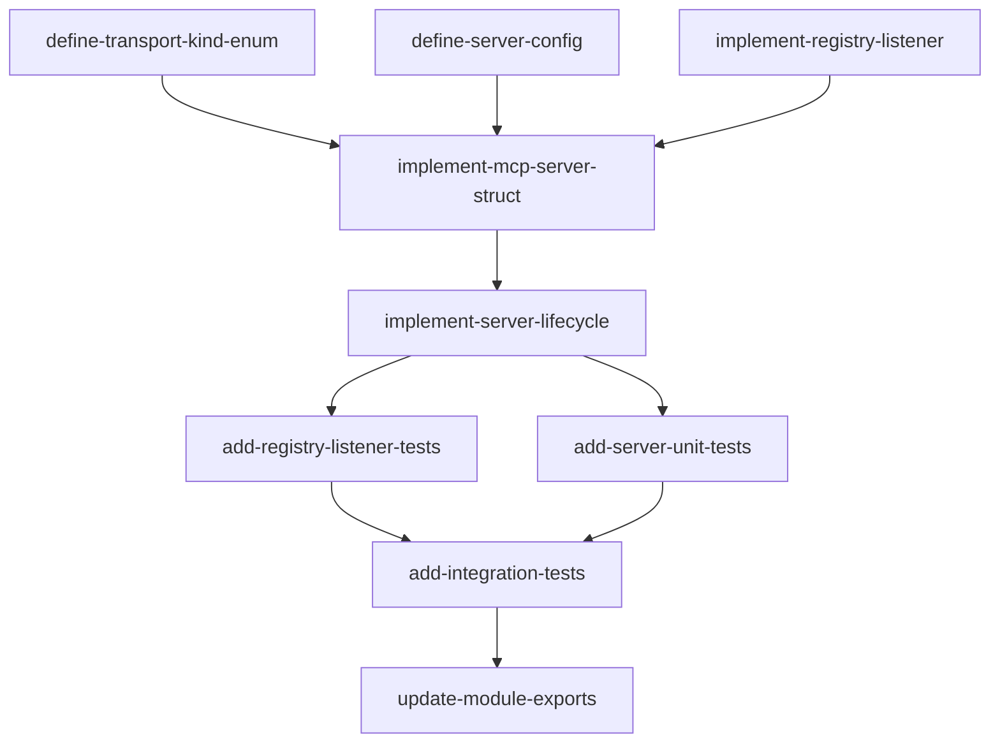

# Server Feature — Implementation Plan

## Goal

Port the Python MCPServer and RegistryListener to idiomatic Rust. MCPServer is a non-blocking server orchestrator that spawns a background tokio task to run the MCP transport loop, with start/wait/stop lifecycle methods. RegistryListener watches an apcore Registry for register/unregister events and maintains a thread-safe tool map.

## Architecture Design

### Component Structure

```
src/server/
  mod.rs          — public re-exports
  server.rs       — MCPServer struct with spawn-based lifecycle
  listener.rs     — RegistryListener with RwLock<HashMap> tool cache
  factory.rs      — (dependency, assumed mostly implemented)
  router.rs       — (dependency, assumed mostly implemented)
  transport.rs    — (dependency, assumed mostly implemented)
```

### Data Flow

```
User code
  |
  v
MCPServer::new(registry_or_executor, config...)
  |
  v
MCPServer::start()
  |-- resolve_registry() / resolve_executor()
  |-- MCPServerFactory::create_server()
  |-- MCPServerFactory::build_tools()
  |-- ExecutionRouter::new()
  |-- register handlers, resource handlers, init options
  |-- Build auth middleware (if authenticator provided + HTTP transport)
  |-- TransportManager::run_*(server, init_options, ...)
  |-- All above run inside tokio::spawn
  |-- Signals "started" via oneshot channel
  |
  v
MCPServer::wait()
  |-- Awaits JoinHandle from spawned task
  |
  v
MCPServer::stop()
  |-- Sends shutdown signal via tokio watch/notify
  |-- Transport loop sees signal and exits gracefully
```

```
Registry
  |-- on("register", callback)
  |-- on("unregister", callback)
  |
  v
RegistryListener
  |-- _on_register: get_definition -> build_tool -> insert into RwLock<HashMap>
  |-- _on_unregister: remove from RwLock<HashMap>
  |-- tools(): read-lock snapshot clone
```

### Technology Choices

| Concern | Choice | Rationale |
|---------|--------|-----------|
| Background execution | `tokio::spawn` + `JoinHandle` | Pure async, no std::thread needed since we are already in a tokio runtime |
| Start signaling | `tokio::sync::oneshot` | One-time "started" notification from spawned task to caller |
| Shutdown signaling | `tokio::sync::watch` or `tokio::sync::Notify` | Allows stop() to signal the transport loop to exit |
| Thread-safe tool map | `std::sync::RwLock<HashMap<String, Tool>>` | Read-heavy workload; `RwLock` allows concurrent readers. No need for `DashMap` given low contention |
| Registry/executor input | Enum `RegistryOrExecutor` | Type-safe alternative to Python's duck-typed `registry_or_executor` parameter |
| Transport enum | `TransportKind` enum | Replace stringly-typed transport with `Stdio`, `StreamableHttp`, `Sse` variants |
| Config struct | `MCPServerConfig` builder | Collect the many optional parameters into a config struct with defaults |
| Tool type | `serde_json::Value` (initially) | Placeholder until MCP tool type is formalized; matches current factory stub |
| Logging | `tracing` crate | Already in Cargo.toml; structured, async-friendly |

### Key Design Decisions

1. **`RegistryOrExecutor` enum over `dyn Any`.** Python uses duck-typing to accept either a Registry or Executor. In Rust, use an enum with two variants. The `resolve_registry()` and `resolve_executor()` functions in `utils.rs` will be updated to accept this enum and extract/construct the appropriate type.

2. **`MCPServerConfig` builder pattern.** The Python constructor has 13+ parameters. Rust idiom is to use a config struct with `Default` and a builder. Required fields (registry_or_executor) go in `new()`, optional fields in builder methods or the config struct.

3. **`TransportKind` enum instead of string.** Eliminates runtime string matching and provides compile-time exhaustiveness checking. Variants: `Stdio`, `StreamableHttp`, `Sse`.

4. **Async `start()` returns immediately after spawn.** Unlike Python which uses `threading.Thread`, we use `tokio::spawn`. The `start()` method awaits the oneshot "started" signal from the spawned task, then returns. The `JoinHandle` is stored for `wait()`.

5. **`stop()` uses a shared shutdown signal.** A `tokio::sync::watch<bool>` or `Notify` is shared between the MCPServer and the spawned task. `stop()` sends the signal; the transport loop checks it and exits.

6. **RegistryListener uses callbacks with `Arc<Self>` pattern.** Since the listener registers callbacks on the registry, the callbacks need a reference to the listener. Use `Arc<RwLock<RegistryListenerInner>>` or have the listener own the state behind an `Arc`.

7. **Idempotent start/stop via `AtomicBool`.** The `_active` flag in RegistryListener uses `std::sync::atomic::AtomicBool` for lock-free idempotent start/stop checks.

## Task Breakdown

### Dependency Graph



### Task List

| Task ID | Title | Est. Time | Dependencies |
|---------|-------|-----------|--------------|
| define-transport-kind-enum | Define TransportKind enum and address formatting | 30 min | none |
| define-server-config | Define MCPServerConfig with builder defaults | 45 min | define-transport-kind-enum |
| implement-registry-listener | Implement RegistryListener with RwLock tool map | 1.5 hr | none |
| implement-mcp-server-struct | Implement MCPServer struct and constructor | 1 hr | define-transport-kind-enum, define-server-config, implement-registry-listener |
| implement-server-lifecycle | Implement start/wait/stop with tokio::spawn | 2 hr | implement-mcp-server-struct |
| add-registry-listener-tests | Unit tests for RegistryListener (TDD) | 1 hr | implement-registry-listener |
| add-server-unit-tests | Unit tests for MCPServer lifecycle (TDD) | 1.5 hr | implement-server-lifecycle |
| add-integration-tests | End-to-end server start/stop tests | 1 hr | add-registry-listener-tests, add-server-unit-tests |
| update-module-exports | Clean up mod.rs exports and remove stubs | 20 min | add-integration-tests |

**Total estimated time: ~9 hours 35 minutes**

## Risks and Considerations

1. **Dependency on unfinished stubs.** `MCPServerFactory`, `ExecutionRouter`, `TransportManager`, and `resolve_registry`/`resolve_executor` are all stubs with `todo!()`. The server feature orchestrates these components. Implementation must either (a) implement these dependencies first, or (b) use trait abstractions to mock them in tests. We choose (b): define traits for Factory, Router, Transport interfaces so the server can be tested independently.

2. **Registry callback model.** The Python Registry uses `registry.on("event", callback)` to register callbacks. The Rust `apcore` crate's Registry API may differ. The RegistryListener implementation must adapt to whatever callback/event API `apcore::Registry` provides. If it uses channels instead of callbacks, the listener design will need adjustment.

3. **Graceful shutdown propagation.** The `stop()` signal must propagate through to the transport layer. `TransportManager` must support cancellation (e.g., via `tokio::select!` on a shutdown receiver). This is a cross-cutting concern that requires coordination with the transport feature implementation.

4. **`start()` timeout.** Python uses `self._started.wait(timeout=10)`. The Rust equivalent should use `tokio::time::timeout` on the oneshot receiver to avoid hanging indefinitely if the spawned task fails before signaling.

5. **Auth middleware integration.** The server builds auth middleware conditionally for HTTP transports. This depends on the auth feature being implemented. For now, the server should accept an `Option<Arc<dyn Authenticator>>` and the auth middleware construction can be gated behind a feature flag or left as a TODO until the auth feature lands.

6. **Thread safety of RegistryListener.** The Python version uses `threading.Lock`. In Rust, `std::sync::RwLock` is the right choice since `tools()` is read-heavy and `_on_register`/`_on_unregister` are write-infrequent. If the callbacks are called from an async context, consider `tokio::sync::RwLock` instead to avoid blocking the runtime.

## Acceptance Criteria

- [ ] Accepts either Registry or Executor as input via `RegistryOrExecutor` enum
- [ ] Resolves registry/executor from input (resolve_registry/resolve_executor)
- [ ] Creates server, router, factory, transport, and listener
- [ ] start() spawns server in background (non-blocking), returns after signaling started
- [ ] wait() blocks (awaits) until server terminates
- [ ] stop() triggers graceful shutdown via signal
- [ ] address() returns "stdio" for Stdio transport, "http://{host}:{port}" for HTTP transports
- [ ] `TransportKind` enum replaces stringly-typed transport parameter
- [ ] `MCPServerConfig` collects optional parameters with sane defaults
- [ ] RegistryListener reacts to register/unregister events
- [ ] RegistryListener provides thread-safe tool snapshot via `RwLock`
- [ ] RegistryListener start/stop are idempotent
- [ ] Applies authentication middleware when authenticator is provided (HTTP transports only)
- [ ] All `#![allow(unused)]` directives removed from server.rs and listener.rs
- [ ] All `todo!()` macros replaced with real implementations
- [ ] Unit tests cover: server lifecycle, address formatting, listener tool registration/unregistration, idempotent start/stop
- [ ] Code compiles with no warnings

## References

- Feature spec: `docs/features/server.md`
- Type mapping: `apcore/docs/spec/type-mapping.md`
- Python reference: `apcore-mcp-python/src/apcore_mcp/server/server.py`
- Python reference: `apcore-mcp-python/src/apcore_mcp/server/listener.py`
- Existing Rust stubs: `src/server/server.rs`, `src/server/listener.rs`
- `tokio::spawn` docs: https://docs.rs/tokio/latest/tokio/fn.spawn.html
- `tokio::sync::oneshot` docs: https://docs.rs/tokio/latest/tokio/sync/oneshot/index.html
