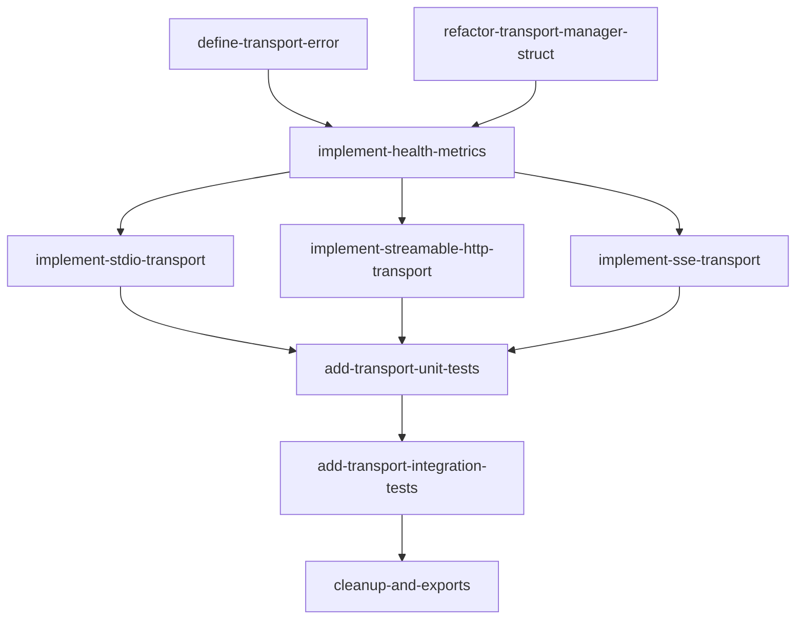

# Transport Feature — Implementation Plan

## Goal

Port the Python `TransportManager` (stdio, streamable-http, SSE transports with health/metrics endpoints) to idiomatic Rust using tokio, axum, tower, and hyper. Replace all `todo!()` stubs in `src/server/transport.rs` with full implementations.

## Architecture Design

### Component Structure

```
src/server/transport.rs  — all transport code lives in a single module
```

No new files are needed. The existing `transport.rs` stub already defines `MetricsExporter` and `TransportManager`; we expand it in place.

### Data Flow

```
                         ┌───────────────────────────────┐
                         │      TransportManager         │
                         │  - start_time: Instant        │
                         │  - module_count: usize        │
                         │  - metrics: Option<Arc<dyn..>>│
                         └──────┬──────┬──────┬──────────┘
                                │      │      │
                    ┌───────────┘      │      └────────────┐
                    v                  v                    v
              run_stdio()     run_streamable_http()     run_sse()
              ┌─────────┐    ┌────────────────────┐   ┌──────────┐
              │ stdin/   │    │ axum Router        │   │ axum     │
              │ stdout   │    │  GET /health       │   │  GET /sse│
              │ JSON-RPC │    │  GET /metrics      │   │  POST    │
              │ loop     │    │  POST/GET/DEL /mcp │   │  /msgs/  │
              └─────────┘    │  + extra_routes     │   │  + health│
                             │  + middleware layers│   │  + metrics│
                             └────────┬───────────┘   └────┬─────┘
                                      │                     │
                              tokio::spawn(mcp_task)  tokio::spawn(mcp_task)
                              axum::serve(listener)   axum::serve(listener)
```

### Technology Choices

| Concern | Choice | Rationale |
|---------|--------|-----------|
| HTTP framework | axum 0.8 | Already in Cargo.toml; native tower integration |
| Middleware | `tower::Layer` / `tower::Service` | Composable; axum `.layer()` support |
| Async runtime | tokio | Already in Cargo.toml; `tokio::select!` for concurrent tasks |
| JSON-RPC stdio | `tokio::io::stdin()`/`stdout()` + `BufReader` | Standard approach for MCP stdio |
| SSE | `axum::response::sse` | Built into axum; no extra dependency |
| Metrics format | `MetricsExporter` trait (existing) | Caller provides exporter impl |
| Time tracking | `tokio::time::Instant` | Monotonic; no system clock drift |
| Session IDs | `uuid::Uuid::new_v4()` | Already in Cargo.toml |
| Error type | `thiserror`-based `TransportError` enum | Already in Cargo.toml; idiomatic |

### Key Design Decisions

1. **`MetricsExporter` stays as a separate trait, not implemented on `TransportManager`.** The Python pattern passes an external `metrics_collector` into the constructor. The current stub incorrectly implements `MetricsExporter` on `TransportManager` itself — we remove that and accept `Option<Arc<dyn MetricsExporter>>` in `new()`.

2. **`build_streamable_http_app` returns a `Router`, not an async context manager.** Rust has no direct equivalent to Python's `@asynccontextmanager`. Instead, we return a `Router` plus a `tokio::task::JoinHandle` for the MCP background task (via a wrapper struct `StreamableHttpApp`). The caller is responsible for aborting the handle on shutdown.

3. **Extra routes use `axum::Router`.** Python uses Starlette `Route`/`Mount` lists. In Rust, callers pass an `axum::Router` that gets merged via `.merge()` or `.nest()`.

4. **Middleware uses `tower::Layer` boxed trait objects.** Python uses `(cls, kwargs)` tuples. In Rust, callers pass `Vec<Box<dyn Layer>>` or we accept a generic tower layer stack. For simplicity, `TransportManager` methods accept a pre-built `tower::ServiceBuilder` layer stack or a `Vec<tower_http::...>` — but the cleanest API is to let the caller apply layers to the returned `Router` themselves. We adopt the pattern where `build_streamable_http_app` returns a bare `Router` and the caller wraps it.

5. **Stdio transport uses line-delimited JSON-RPC.** Each message is a single JSON object terminated by newline, read via `tokio::io::BufReader::read_line()`.

6. **SSE transport is marked deprecated but fully functional.** Matches the Python pattern of logging a deprecation warning.

7. **`TransportError` enum for all failure modes.** Covers: `InvalidHost`, `InvalidPort`, `IoError`, `ServerError`, `BindError`.

## Task Breakdown

### Dependency Graph



### Task List

| Task ID | Title | Est. Time | Dependencies |
|---------|-------|-----------|--------------|
| define-transport-error | Define `TransportError` enum with thiserror | 30 min | none |
| refactor-transport-manager-struct | Refactor `TransportManager` struct fields and constructor | 30 min | none |
| implement-health-metrics | Implement health and metrics endpoint handlers | 45 min | define-transport-error, refactor-transport-manager-struct |
| implement-stdio-transport | Implement `run_stdio` with tokio stdin/stdout | 1.5 hr | implement-health-metrics |
| implement-streamable-http-transport | Implement `run_streamable_http` and `build_streamable_http_app` | 2 hr | implement-health-metrics |
| implement-sse-transport | Implement `run_sse` with SSE endpoints (deprecated) | 1.5 hr | implement-health-metrics |
| add-transport-unit-tests | Unit tests for all transport components | 1.5 hr | implement-stdio-transport, implement-streamable-http-transport, implement-sse-transport |
| add-transport-integration-tests | Integration tests: HTTP server start, health check, metrics | 1.5 hr | add-transport-unit-tests |
| cleanup-and-exports | Remove stubs, allow(unused), update mod.rs exports | 20 min | add-transport-integration-tests |

**Total estimated time: ~10 hours 5 minutes**

## Risks and Considerations

1. **MCP protocol crate availability.** The Python implementation uses `mcp.server.lowlevel.Server`, `mcp.server.streamable_http.StreamableHTTPServerTransport`, etc. There is no established Rust MCP crate equivalent. We may need to define our own MCP JSON-RPC protocol handling traits or use a generic JSON-RPC crate. The task plan assumes we define a minimal `McpServer` trait that represents the MCP protocol handler, with the actual protocol wired in later.

2. **SSE implementation complexity.** axum's built-in SSE support (`axum::response::Sse`) works for server-to-client streaming. The MCP SSE transport also needs a POST endpoint for client-to-server messages, which requires shared state (channel) between the SSE stream and the POST handler.

3. **Stdio transport testing.** Testing stdin/stdout requires piping or mock I/O. We abstract the I/O behind `AsyncRead`/`AsyncWrite` traits so tests can use `tokio_test` or in-memory buffers.

4. **Graceful shutdown.** The Python version uses `anyio.create_task_group()` with scope cancellation. In Rust, we use `tokio::select!` with a shutdown signal (e.g., `tokio::signal::ctrl_c()` or a `tokio::sync::watch` channel).

5. **Middleware composability.** The Python pattern of `app = MwCls(app, **kwargs)` wraps ASGI apps. In Rust/tower, middleware is applied via `.layer()` on the Router before serving. We keep the API simple: `build_streamable_http_app` returns a `Router` that the caller layers themselves.

6. **Port binding conflicts in tests.** Integration tests that bind to network ports must use port 0 (OS-assigned) to avoid conflicts in CI.

## Acceptance Criteria

- [ ] `TransportError` enum covers: invalid host, invalid port, I/O errors, bind failures
- [ ] `TransportManager::new()` accepts `Option<Arc<dyn MetricsExporter + Send + Sync>>`
- [ ] `set_module_count()` updates internal count for health reporting
- [ ] `_build_health_response()` returns JSON with status, uptime_seconds, module_count
- [ ] `_build_metrics_response()` returns Prometheus text (200) or 404 if no exporter
- [ ] `run_stdio()` reads/writes MCP JSON-RPC over stdin/stdout
- [ ] `run_streamable_http()` serves MCP at /mcp, health at /health, metrics at /metrics
- [ ] `build_streamable_http_app()` returns a `Router` suitable for embedding
- [ ] `run_sse()` serves SSE at /sse, POST at /messages/, plus health and metrics
- [ ] SSE transport logs deprecation warning
- [ ] Host/port validation rejects empty host and out-of-range port
- [ ] Extra routes can be merged into HTTP transports
- [ ] `tokio::select!` or `JoinSet` used for concurrent MCP + HTTP serving
- [ ] All `#![allow(unused)]` directives removed
- [ ] All `todo!()` macros replaced with real implementations
- [ ] Unit tests cover: health response, metrics response (with/without exporter), host/port validation
- [ ] Integration tests cover: HTTP server bind + health check round-trip
- [ ] Code compiles with no warnings

## References

- Feature spec: `docs/features/transport.md`
- Type mapping: `apcore/docs/spec/type-mapping.md`
- Python reference: `apcore-mcp-python/src/apcore_mcp/server/transport.py`
- Existing Rust stub: `src/server/transport.rs`
- axum docs: https://docs.rs/axum/0.8
- tower docs: https://docs.rs/tower/0.5
- tokio I/O: https://docs.rs/tokio/1/tokio/io
