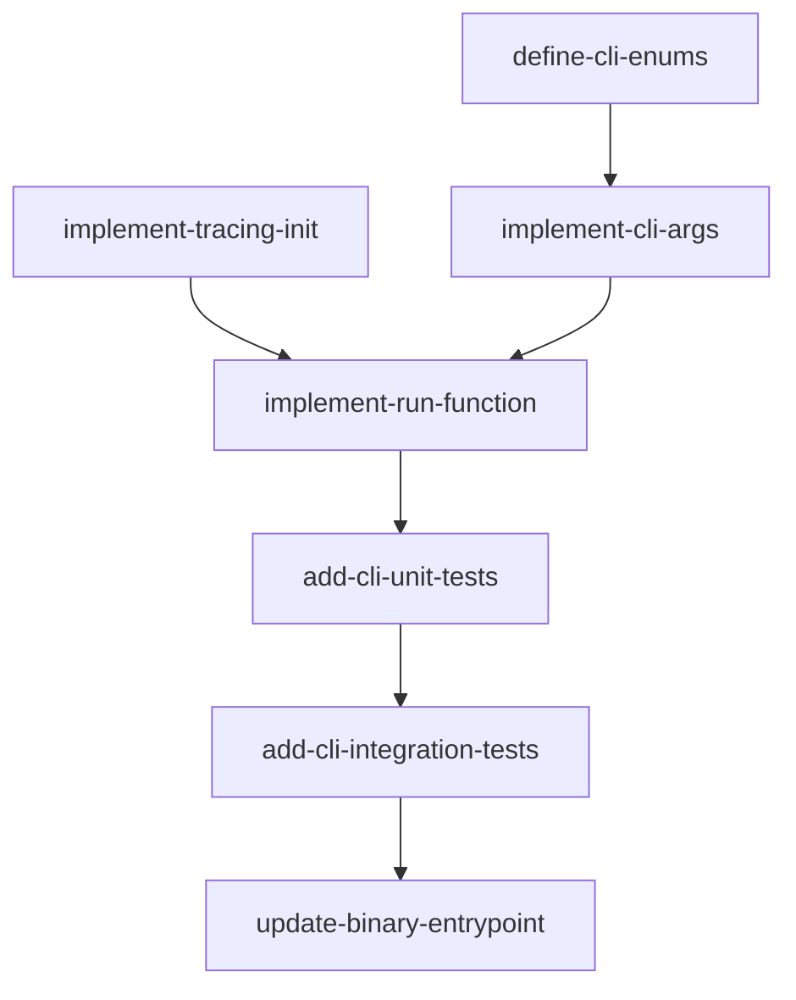

# CLI Feature — Implementation Plan

## Goal

Port the Python CLI entry point (`__main__.py`) to idiomatic Rust using clap (derive), tracing-subscriber, and tokio. The CLI parses all arguments, resolves JWT keys, selects an approval handler, and delegates to the `serve()` function.

## Architecture Design

### Component Structure

```
src/
  cli.rs          — CliArgs struct (clap derive), Transport/ApprovalMode/LogLevel enums, run() function
  bin/apcore-mcp.rs — calls apcore_mcp::cli::run()
```

The existing `src/cli.rs` stub has partial `CliArgs` but is missing most fields and all logic. It will be rewritten in-place.

### Data Flow

```
CLI invocation
  |
  v
CliArgs::parse()  (clap)
  |-- validate extensions_dir exists and is a directory
  |-- validate name length <= 255
  |
  v
init_tracing(log_level)
  |-- tracing_subscriber with EnvFilter
  |
  v
resolve_jwt_key()
  |-- --jwt-key-file > --jwt-secret > JWT_SECRET env
  |-- build JWTAuthenticator if key found
  |
  v
build_approval_handler(approval_mode)
  |-- elicit -> ElicitationApprovalHandler
  |-- auto-approve -> AutoApproveHandler
  |-- always-deny -> AlwaysDenyHandler
  |-- off -> None
  |
  v
serve(registry, config...)
  |-- on error -> exit(2)
```

### Technology Choices

| Concern | Choice | Rationale |
|---------|--------|-----------|
| Arg parsing | clap 4 (derive) | Already in Cargo.toml; idiomatic Rust CLI |
| Logging | tracing + tracing-subscriber | Already in Cargo.toml; `EnvFilter` for level control |
| Async runtime | tokio (full) | Already in Cargo.toml; required by serve() |
| Transport enum | clap `ValueEnum` | Type-safe transport selection with auto validation |
| Approval enum | clap `ValueEnum` | Type-safe approval mode selection |
| Log level enum | clap `ValueEnum` | Maps to tracing `LevelFilter` |
| Port validation | clap `value_parser!(u16)` | Implicit 1-65535 via u16 type, plus custom range check for 1-65535 |
| Exit codes | `std::process::exit()` | Match Python: 0=normal, 1=bad args, 2=startup failure |
| JWT key resolution | Private helper function | Same chain as Python: file > arg > env |

### Key Design Decisions

1. **Use clap `ValueEnum` for enums.** Transport, ApprovalMode, and LogLevel will be enums with `#[derive(ValueEnum)]` for automatic CLI validation and help text generation.

2. **Port validation stays in `value_parser` where possible.** clap's `u16` type handles port range 0-65535 automatically; we add a custom validator for the 1-65535 constraint. Name length is validated post-parse.

3. **`--jwt-require-auth` / `--no-jwt-require-auth` pattern.** clap supports this via `#[arg(long, default_value_t = true, action = ArgAction::Set)]` combined with `--no-` prefix negation.

4. **Async `run()` with `#[tokio::main]`.** The `run()` function is async since `serve()` is async. The binary entry point uses `#[tokio::main]`.

5. **Exit code 1 for validation errors.** Extensions dir validation, name length, and JWT key file checks all exit with code 1. Server startup failures exit with code 2.

6. **Default port is 8000** (matching Python), not 8080 as in the current stub.

## Task Breakdown

### Dependency Graph



### Task List

| Task ID | Title | Est. Time | Dependencies |
|---------|-------|-----------|--------------|
| define-cli-enums | Define Transport, ApprovalMode, LogLevel enums with ValueEnum | 30 min | none |
| implement-cli-args | Implement full CliArgs struct with all arguments | 45 min | define-cli-enums |
| implement-tracing-init | Implement tracing subscriber initialization from LogLevel | 30 min | none |
| implement-run-function | Implement run() with validation, JWT resolution, approval handler | 1.5 hr | implement-cli-args, implement-tracing-init |
| add-cli-unit-tests | TDD unit tests for arg parsing, validation, JWT key resolution | 1.5 hr | implement-run-function |
| add-cli-integration-tests | Integration tests for CLI invocation with process exit codes | 1 hr | add-cli-unit-tests |
| update-binary-entrypoint | Update bin/apcore-mcp.rs for async main and final cleanup | 20 min | add-cli-integration-tests |

**Total estimated time: ~6 hours 5 minutes**

## Risks and Considerations

1. **`--jwt-require-auth` / `--no-jwt-require-auth` clap pattern.** clap 4 handles boolean negation via `#[arg(long = "jwt-require-auth", action = ArgAction::SetTrue)]` paired with `#[arg(long = "no-jwt-require-auth", action = ArgAction::SetFalse)]`. Alternative: use `clap::builder::BoolishValueParser`. Needs testing to match Python's `BooleanOptionalAction`.

2. **Dependency on `serve()` signature.** The `run()` function calls `serve()` (or `APCoreMCPBuilder`) which may not be fully implemented yet. Use a trait-based or config-struct approach so `run()` can be tested independently of the server.

3. **Extensions dir validation timing.** In Python, the directory is validated before `Registry` construction. In Rust, the same order must be preserved: validate path, then create registry.

4. **Log level mapping.** Python uses `DEBUG/INFO/WARNING/ERROR`. Rust tracing uses `TRACE/DEBUG/INFO/WARN/ERROR`. Map Python `WARNING` to tracing `WARN`. `DEBUG` maps directly.

5. **`--version` flag conflict.** clap's `#[command(version)]` adds a `--version` flag that prints the package version and exits. The CLI also has a `--version` *argument* that sets the MCP server version string. These must be disambiguated — use `--server-version` or rename the clap built-in. Python uses `--version` as a server version argument (not an info flag), so we should keep `--version` as the server version argument and use `#[command(version)]` for the clap-level version display. Actually, clap uses `-V` / `--version` for the info flag. We should rename the server version arg to `--server-version` or disable the built-in version flag. The spec says `--version` sets the MCP server version, so keep it and remove `#[command(version)]` in favor of a manual implementation.

6. **Exempt paths parsing.** The `--exempt-paths` argument takes a comma-separated string. Parse into `HashSet<String>` in `run()`.

## Acceptance Criteria

- [ ] All CLI args match the feature spec / Python implementation
- [ ] JWT key resolution: --jwt-key-file > --jwt-secret > JWT_SECRET env
- [ ] Exit codes: 0=normal, 1=invalid args, 2=startup failure
- [ ] Configures tracing subscriber based on --log-level
- [ ] Approval mode selection creates correct handler
- [ ] Extensions directory path is validated (exists, is directory)
- [ ] Name length validated (<= 255 characters)
- [ ] Port validated in range 1-65535
- [ ] Transport, ApprovalMode, LogLevel enums use clap ValueEnum
- [ ] Default values match Python: transport=stdio, host=127.0.0.1, port=8000, name="apcore-mcp", log-level=INFO, approval=off
- [ ] `--jwt-require-auth` defaults to true, `--no-jwt-require-auth` sets it to false
- [ ] `--exempt-paths` parsed as comma-separated set
- [ ] All `#![allow(unused)]` directives removed
- [ ] All `todo!()` macros replaced with real implementations
- [ ] Code compiles with no warnings

## References

- Feature spec: `docs/features/cli.md`
- Python reference: `apcore-mcp-python/src/apcore_mcp/__main__.py`
- Current Rust stub: `src/cli.rs`
- Binary entry point: `src/bin/apcore-mcp.rs`
- clap derive docs: https://docs.rs/clap/4/clap/_derive/index.html
- tracing-subscriber docs: https://docs.rs/tracing-subscriber/0.3
