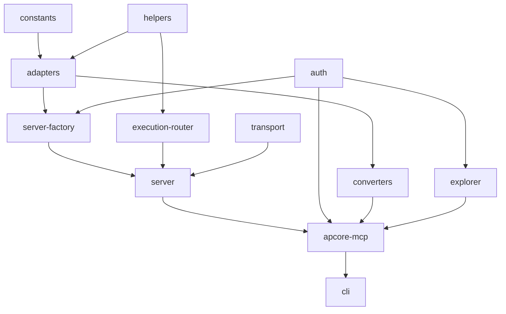

# apcore-mcp-rust — Implementation Overview

## Overall Progress

```
[░░░░░░░░░░░░░░░░░░░░] 0/90 tasks (0%)
```

| Status | Count |
|--------|-------|
| Completed | 0 |
| In Progress | 0 |
| Pending | 90 |

## Module Overview

| # | Module | Description | Status | Tasks |
|---|--------|-------------|--------|-------|
| 1 | [constants](./constants/) | Error codes, registry events, module ID pattern | pending | 0/5 |
| 2 | [helpers](./helpers/) | MCP progress reporting and elicitation helpers | pending | 0/6 |
| 3 | [adapters](./adapters/) | Annotations, errors, schema, ID normalizer, approval | pending | 0/6 |
| 4 | [auth](./auth/) | Authenticator trait, JWT, tower middleware | pending | 0/8 |
| 5 | [server-factory](./server-factory/) | MCP tool builder and handler registration | pending | 0/9 |
| 6 | [execution-router](./execution-router/) | Route MCP calls to apcore executor | pending | 0/9 |
| 7 | [transport](./transport/) | stdio, streamable-http, SSE transports | pending | 0/9 |
| 8 | [server](./server/) | MCPServer lifecycle and RegistryListener | pending | 0/9 |
| 9 | [converters](./converters/) | OpenAI function-calling format converter | pending | 0/5 |
| 10 | [explorer](./explorer/) | Web UI for MCP tool introspection | pending | 0/6 |
| 11 | [apcore-mcp](./apcore-mcp/) | Unified APCoreMCP API and builder | pending | 0/10 |
| 12 | [cli](./cli/) | CLI binary with clap argument parsing | pending | 0/7 |

## Module Dependencies



## Recommended Implementation Order

### Phase 1: Foundation (no dependencies)
| # | Feature | Rationale |
|---|---------|-----------|
| 1 | constants | All other modules depend on error codes and patterns |
| 2 | helpers | Required by adapters and execution-router |
| 3 | auth | Independent; required by server-factory and explorer |

**Why first:** These are leaf modules with no internal dependencies. They establish the type system and patterns used everywhere else.

### Phase 2: Adapters & Converters
| # | Feature | Rationale |
|---|---------|-----------|
| 4 | adapters | Depends on constants; required by server-factory, converters |
| 5 | converters | Depends on adapters; reuses schema, annotations, ID normalizer |

**Why next:** Adapters are the bridge between apcore types and MCP types. Everything above the adapter layer depends on them.

### Phase 3: Server Infrastructure
| # | Feature | Rationale |
|---|---------|-----------|
| 6 | server-factory | Depends on adapters, auth; creates MCP tools and handlers |
| 7 | execution-router | Depends on adapters, helpers; handles call routing |
| 8 | transport | Independent transport layer (stdio, HTTP, SSE) |
| 9 | server | Orchestrates factory + router + transport + listener |

**Why next:** Server infrastructure builds on adapters and auth. These must be complete before the unified API.

### Phase 4: Integration & Polish
| # | Feature | Rationale |
|---|---------|-----------|
| 10 | explorer | Depends on auth; web UI mount |
| 11 | apcore-mcp | Depends on server, auth, converters, explorer — unified API |
| 12 | cli | Depends on apcore-mcp; final binary entry point |

**Why last:** These are integration layers that compose all lower-level modules.

## Reference Documents

- [Protocol Spec](../../apcore/PROTOCOL_SPEC.md)
- [Type Mapping](../../apcore/docs/spec/type-mapping.md)
- [Python Reference](../../apcore-mcp-python/)
- [Rust Core SDK](../../apcore-rust/)
